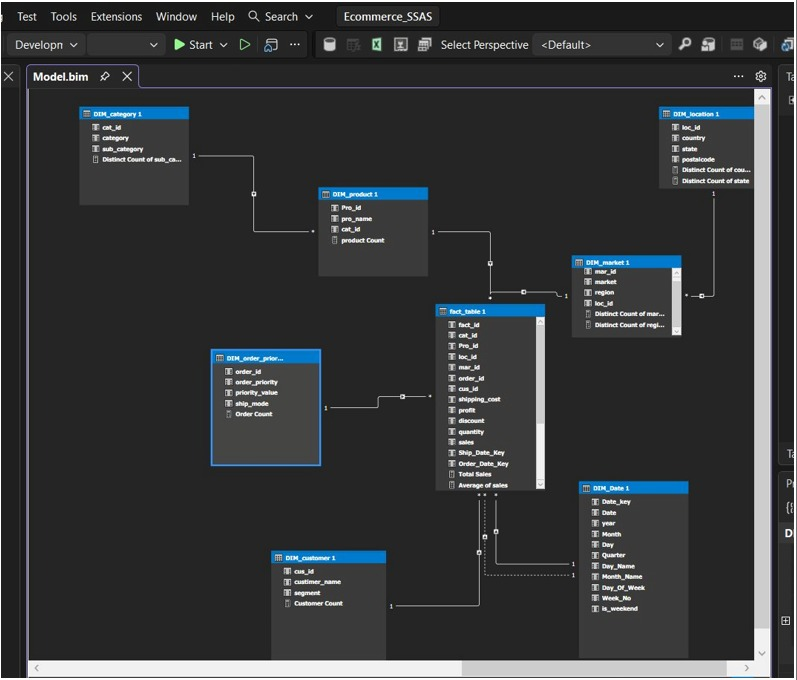
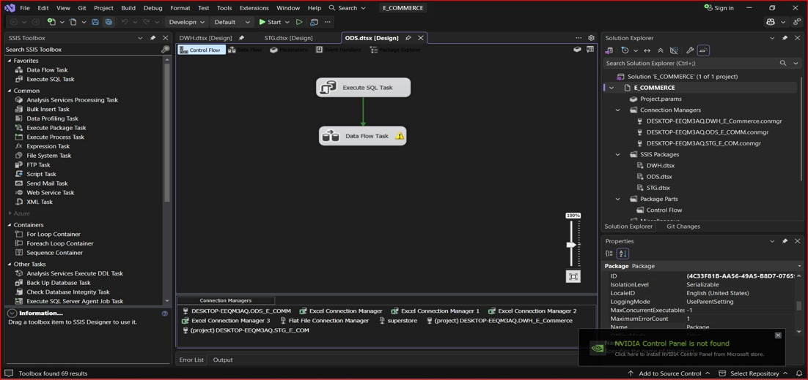
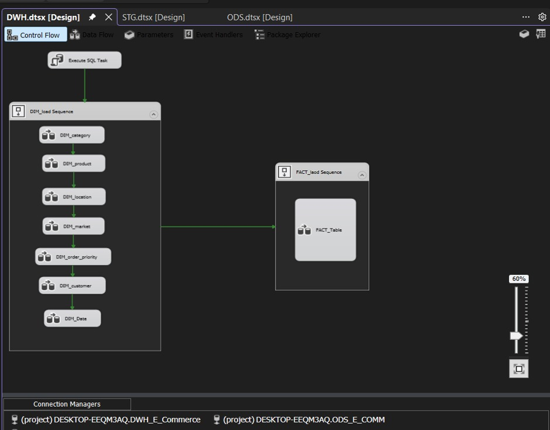
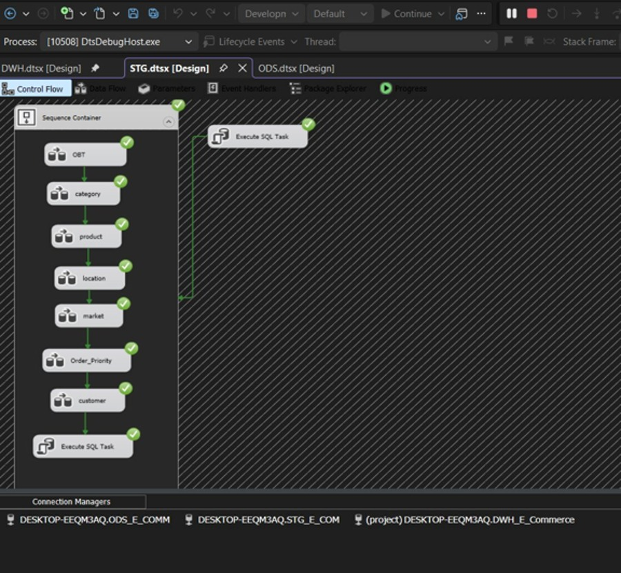
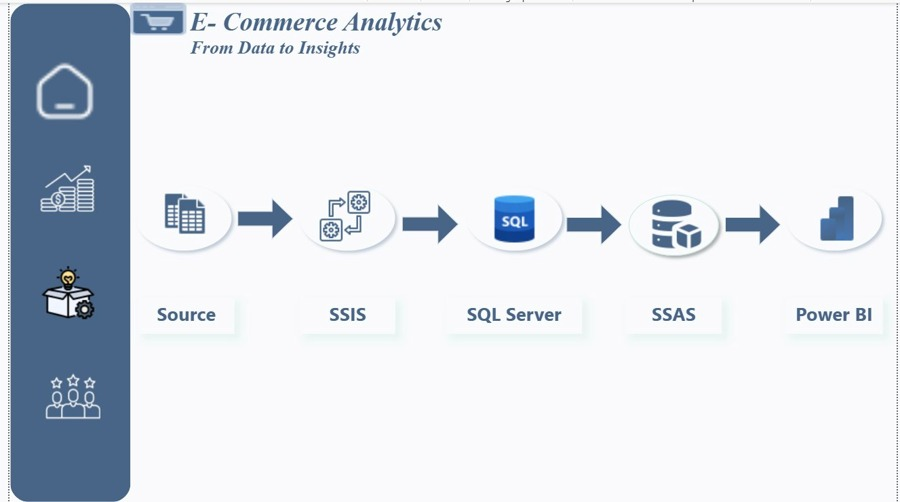
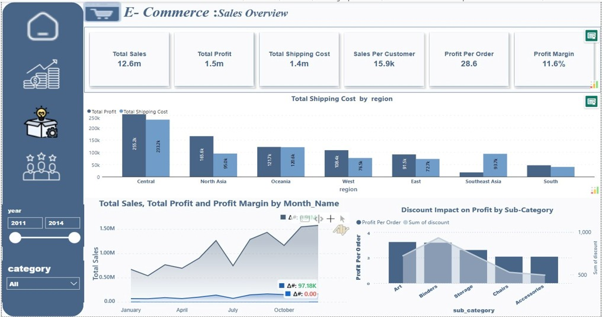
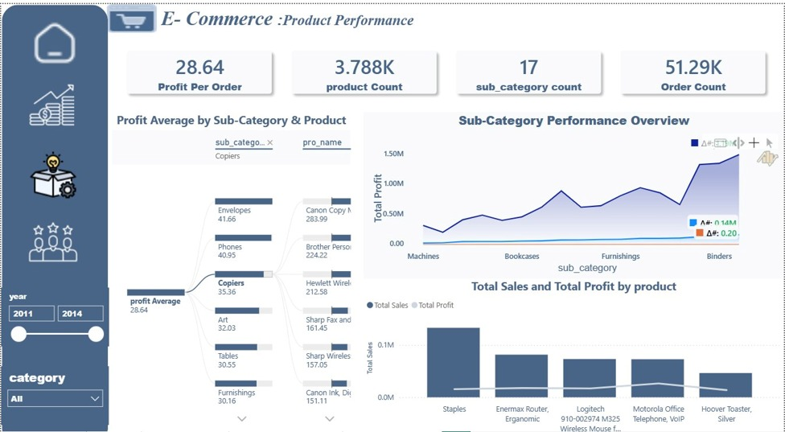
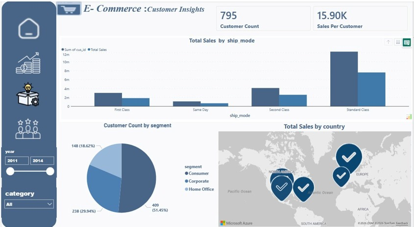

# 🛒 E-COMMERCE ANALYTICS: End-to-End BI Platform
### From Data to Insights | Enterprise Data Engineering & Business Intelligence
**Architecture:** Excel Source ➔ SSIS (ETL) ➔ SQL Server (DWH) ➔ SSAS Tabular ➔ Power BI (DirectQuery)

---

## 📝 Executive Summary
This project demonstrates a production-quality, End-to-End Data Engineering and Business Intelligence solution developed for the **SuperStore Orders dataset** (51,290 rows × 21 columns) covering 4 years of transactional data (2011–2014) across 7 global markets. Built strictly aligned with Ralph Kimballs dimensional modeling methodology.

* **Time Coverage:** 2011 – 2014 | 7 Global Markets | 3 Product Categories
* **Dashboard Pages:** Home • Sales Overview • Product Performance • Customer Insights

---

## 📐 1. Data Modeling & Architecture
Data modeling was conducted in three progressive stages: **Conceptual ➔ Logical ➔ Physical**. The core design implements a robust **Star Schema** with surrogate keys to enforce referential integrity.

### 👥 Physical Schema (Data Warehouse Diagram)

* **Fact Table Grain:** One row per individual order line item.
* **Role-Playing Dimension:** DIM_Date participates twice—active relationship for *Order Date*, and an inactive relationship for *Ship Date* (activated via USERELATIONSHIP in DAX).

---

## ⚙️ 2. ETL Development (SSIS Pipeline)
The ETL architecture is divided into three automated SQL Server Integration Services (SSIS) packages inside a unified solution (E_COMMERCE.sln):

1. **ODS.dtsx (Operational Data Store):** Ingests raw Excel data, standardizing date text formats and extracting embedded components using Derived Columns.
2. **STG.dtsx (Staging Layer):** Cleanses, type-casts, and populates all 7 dimension tables sequentially within a Sequence Container to honor parent-child FK hierarchies. It orchestrates a recursive CTE stored procedure (sp_CreateDimDate) to generate a dynamic Date Dimension.
3. **DWH.dtsx (Data Warehouse):** Executes a chained sequence of 8 Lookup transformations to map business keys to data warehouse surrogate keys, loading the final enriched fact table.

### 🔄 SSIS Package Precedence & Lookup Chain

---

## 🧠 3. SSAS Semantic Layer & DAX Measures
SQL Server Analysis Services (SSAS) was deployed in **Tabular Mode** (Ecommerce_SSAS) to act as the high-performance analytical engine over the SQL Data Warehouse.

### 🔗 Semantic Relationships

### 📈 Core Business Calculated Measures (DAX)
| Measure Name | DAX Formula / Logic |
| :--- | :--- |
| **Total Sales** | SUM(fact_table[sales]) |
| **Total Profit** | SUM(fact_table[profit]) |
| **Total Shipping Cost** | SUM(fact_table[shipping_cost]) |
| **Profit Margin** | DIVIDE([Total Profit], [Total Sales]) |
| **Sales This Month** | TOTALMTD([Total Sales], DIM_Date 1[Date]) |
| **Customer Count** | DISTINCTCOUNT(fact_table[cus_id]) |

---

## 📊 4. Power BI Interactive Dashboard
The presentation layer establishes a live **DirectQuery** connection to the SSAS model, utilizing a streamlined dark-blue navigation sidebar and synchronized cross-page slicing filters.

### 🏠 Home & Pipeline Navigation

### 📈 Executive Sales Overview

### 📦 Product & Customer Insights Pages

---

## 🛠️ Technical Challenges & Resolutions
* **Mixed Date Formats:** Handled using SSIS string expressions REPLACE() and re-ordered using a SUBSTRING + FINDSTRING combination during raw ingestion.
* **FK Constraint Violations:** Enforced deterministic multi-task dependencies using an organized SSIS Sequence Container.
* **Role-Playing Dimension:** Overcame the dual-date linkage limitation by configuring an inactive reference in SSAS, programmatically triggered via DAX formulas.

---

### 📁 Reference Note
Full detailed functional data specs and documentation are available locally in the root directory file: **ECommerce_Project_Documentation.docx**.

---
*Developed under the Data Engineering & Analytics Track • Digital Egypt Youth Program • National Telecommunication Institute (NTI) • 2026*
